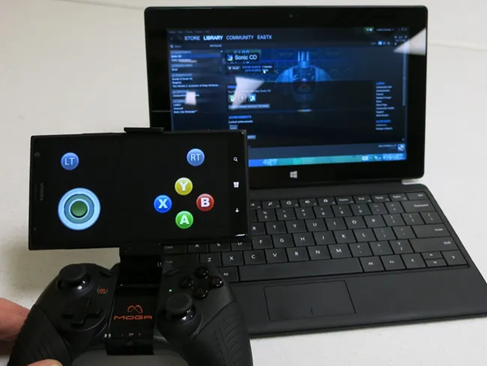

# KinoConsole 

KinoConsole for WP 8.1 R.E. / RnD

## About the original
KinoConsole is the (a) famous "Video Screen streaming service". 
Sadly, its W10M developing stopped... No new features. I am interesting in KinoConsole tech. :)

## Screenshot (by Windows Central)

## My 2 cents
- Appx Decomp.
- Fast code/architecture research
- WP8 -> W10M code "rebase" ("refactor.") - 5 % only  

## Result
- Draft / Damaged
- I haven't much time... but I'm still trying to complete my strang "KinoConsole reburn" idea ))

## References / License
- https://www.windowscentral.com/kinoconsole-review KinoConsole review: Stream and play PC games on your Windows Phone :: By Paul Acevedo last updated August 02, 2014
- MIT

## ..
As is. No support. RnD only. DIY

## .
[m][e] 2023

