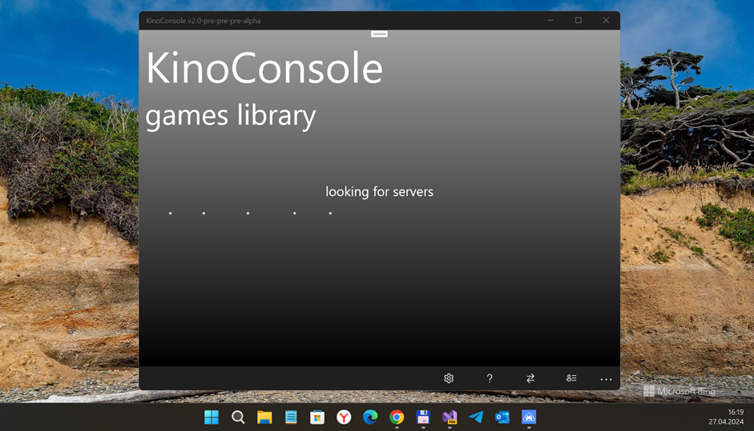
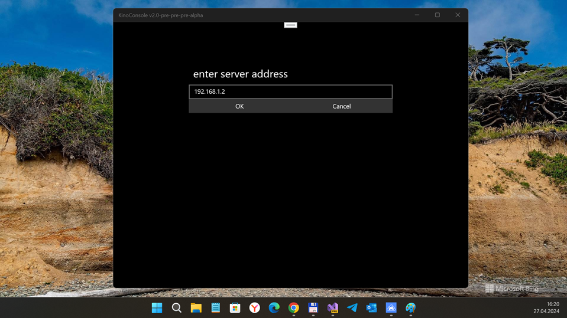

# KinoConsole v2.0-pre-pre-pre-alpha

KinoConsole 1.4 WP 8.1 R.E. / RnD

## About the original
KinoConsole is the (a) famous "Video Screen streaming service". 
Sadly, its W10M developing stopped... No new features. I am interesting in KinoConsole tech. :)

## Screenshots

## My 2 cents
- Appx Decomp.
- Fast code/architecture research
- WP8 -> W10M code "rebase" ("refactor.") - 7 % ready 
- Min. compatible Win SDK version is set to 15063 at now (not at 10240). 

## Result
- Draft / Not fully ported to uwp yet... but compile ok.
- I haven't so much time... but I'm still trying to complete my strange "KinoConsole reburn" idea :)

## TODO
- Reconstruct NativeLib (UWP C++?)
- Fix 100500 bugs

## References / License
- https://www.windowscentral.com/kinoconsole-review KinoConsole review: Stream and play PC games on your Windows Phone :: By Paul Acevedo last updated August 02, 2014
- https://www.youtube.com/watch?v=pHlhc4QwR8M KinoConsole: Stream and play PC games on Windows Phone (Youtube, WindowsCentral video)
- MIT

## ..
As is. No support. RnD only. DIY

## .
[m][e] 2024

