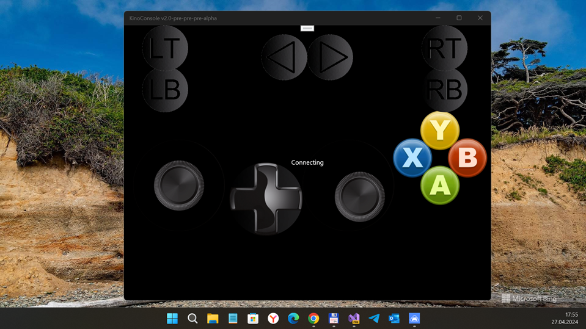

# KinoConsole v2.0-pre-pre-pre-alpha

KinoConsole 1.4 WP 8.1 R.E. / RnD

## About the original
KinoConsole is the (a) famous "Video Screen streaming service" for WindowsPhone 8(.1). 
Sadly, Kinoni, makers of the KinoniConsole 1.4, cancelled its KinoConsole UWP app. So, its WindowsPhone project stopped. No new features. No bug fixes such as save/restore settings problem. I'm interesting in KinoConsole tech... And I still dreaming on some KinoConsole "reborn"... but idk how to realize it at "single-person-mode". :)

## Screenshots

## My 2 cents
- KinoConsole Client & RdConfig Server RnD
- Fast code/architecture research
- WP8 -> W10M code "rebase" ("refactor.") - 7 % ready 
- Min. compatible Win SDK version is set to 16299 at now (not at 10240 or 15063 yet).
- RdConfig Server: .NET 4.8 Compatibility added (for Modern Win 10 / Win 11 without .NET 2/ .NET 3)  

## Result
- Draft / Not fully ported to uwp yet... but compile ok.
- I haven't so much time... but I'm still trying to complete my strange "KinoConsole reburn" idea :)

## TODO
- Reconstruct NativeLib (UWP C++?)
- Fix 100500 bugs

## References / License
- https://www.windowscentral.com/kinoconsole-review KinoConsole review: Stream and play PC games on your Windows Phone :: By Paul Acevedo last updated August 02, 2014
- https://www.youtube.com/watch?v=pHlhc4QwR8M KinoConsole: Stream and play PC games on Windows Phone (Youtube, WindowsCentral video)
- MIT

## ..
As is. No support. RnD only. DIY

## .
[m][e] 2024

