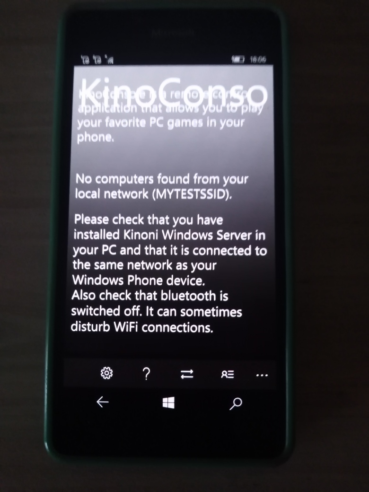
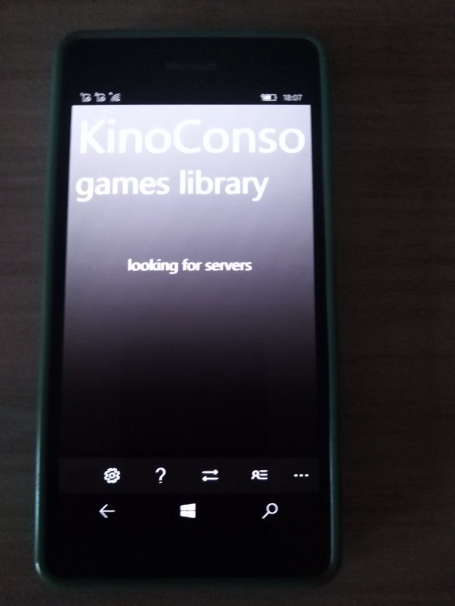
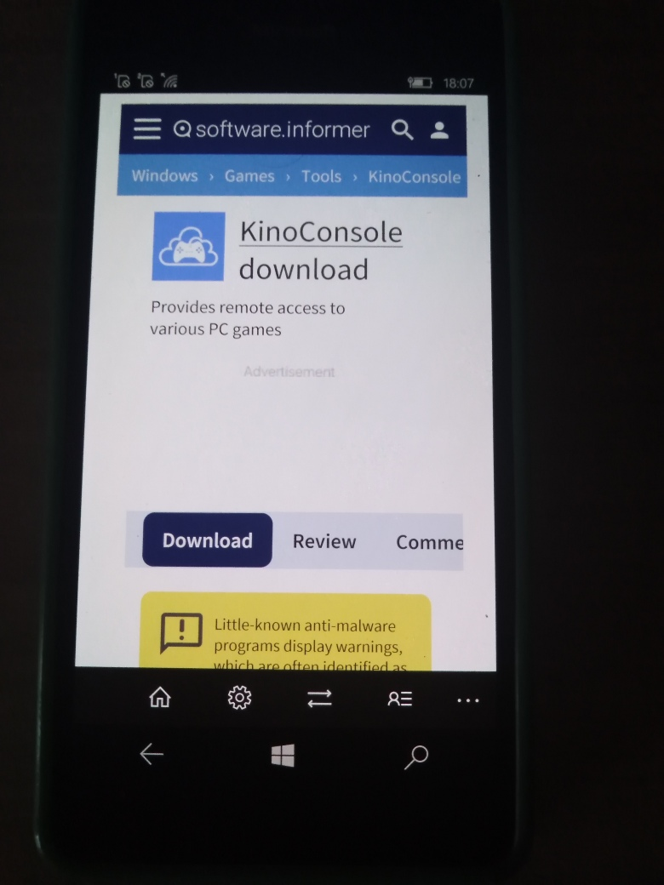

# KinoConsole v2.0.100-alpha - dev branch

KinoConsole 1.4 WP R.E. & KinoConsole 2.0 *UWP edition* slow dev

## About
KinoConsole 1.4 was the a famous "Video Screen streaming service" from some desktop PC to WindowsPhone 8. 
Sadly, Kinoni, makers of the KinoniConsole 1.4 cancelled KinoConsole UWP app dev.  No new features. No bug fixes. At now it's only frozen project. As retro-man, I'm interestied in KinoConsole clent-server tech... So, I'm still dreaming on some KinoConsole "reborn".
Only 1 big question: idk how to realize it at "single-person-mode". I have not any dev command. At 2025, I decide to try some AI for co-pilod "wibe codding"... And who knows... maybe one day my dream will come true :)

## Screenshots

## My 2 cents
- KinoConsole 2.0 Client & RDConfig Server dev 
- Fast kinoconsole/rdconfig code/architecture research
- WP8 -> W10M code "rebase" ("refactor.") - 25 % ready 
- Client: Min. compatible Win SDK version is set to 15063 at now (not to 10240, so, no Astoria compatibility at now).
- Server: .NET 4.8 Compatibility added (for Modern Win 10 / Win 11 without .NET 2/ .NET 3)  

## Status
- Draft CLient (partially ported to uwp, not operatable).
- My chat fragments (with AI) added to Wiki section

## TODO
- Reconstruct NativeLib (UWP C++?)
- Fix 100500 bugs

## References / License
- https://www.windowscentral.com/kinoconsole-review KinoConsole review: Stream and play PC games on your Windows Phone :: By Paul Acevedo last updated August 02, 2014
- https://www.youtube.com/watch?v=pHlhc4QwR8M KinoConsole: Stream and play PC games on Windows Phone (Youtube, WindowsCentral video)
- MIT

## ..
As is. No support. RnD only. DIY

## .
[m][e] 2024--2025

